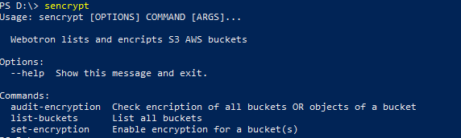
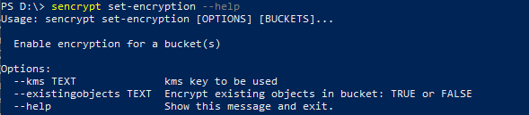

# Automating AWS with Python

## 01-webotron

Webotron contains scripts that will automate AWS using python. The firstone is sencrypt

## sencrypt

Sencrypt project is based on the open source project from uptick : https://github.com/uptake/cloudbouncer 

There are multiple commands that cloudbouncer implements, one of which checks if S3 buckets are encrypted, and the status of each object in S3 bucket. I have modified and using python libraries like click (to simplified and reduce the code) and twine (to make it in to an installable package) and also published in pypi so you can install and try quickly.

### How to use

`$ pip install sencrypt`

make sure to use python3 

`$ pip3 install sencrypt` 

This would install the sencrypt on your machine.

Run sencrypt at the command prompt to see the help.

`$ sencrypt`

As you see there are three commands as a part of this package

You can see help on each command my simply running with --help option

This function would set encription on all the buckets, either using default serverside encription or if you specify --kms would use the kms key to encrypt the specified bucket(s)

As we know encripting the bucket would NOT encrypt the existingobjects in that bucket.

The `--existingobjects` with a `TRUE` would encrypt all the existing objects with teh specified encryption.   
default value is FASLE as encripting existing b=objects takes long time based on number of objects in the bucket.

#### Sample commands

`$ sencrypt audit-encryption` 
    displays current state of encryption of all the buckets

`$ sencrypt audit-encryption <bucketName>` 
    displays current state of encryption of the specified bucket with all its objects.

`$ sencrypt set-encryption <bucketName>` 
    sets the encryption of the specified bucket with Serverside encryption.

`$ sencrypt set-encryption <bucketName> --existingobjects TRUE` 
    sets the encryption of all the objects in the specified bucket with serverside encryption.

`$ sencrypt set-encryption <bucketName> --kms kmskey` 
    sets the encryption of the specified bucket with KMS encryption.

## Code

Libraries used:

   `click` https://click.palletsprojects.com/en/7.x/ python library to create the command line interface. 
   
   `twine` to build the `sdist` package and upload to pypi repository  
   
Python Virtual environment is managed using 'pipenv' and above two packages were installed in dev environment ONLY. 

#### Pre requisites
To run these commands the code currently uses the AWS default profile, and assumes the machine/user has privileges to access the s3 buckets.    
   
